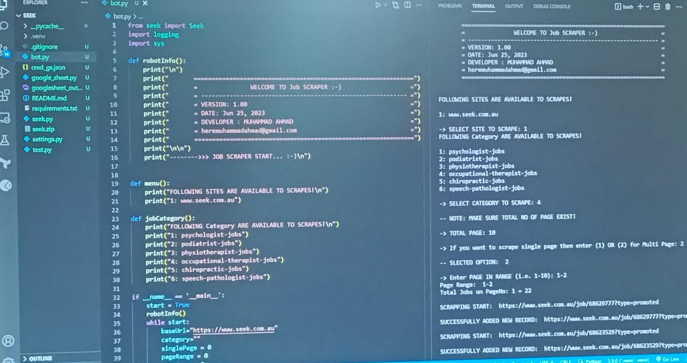
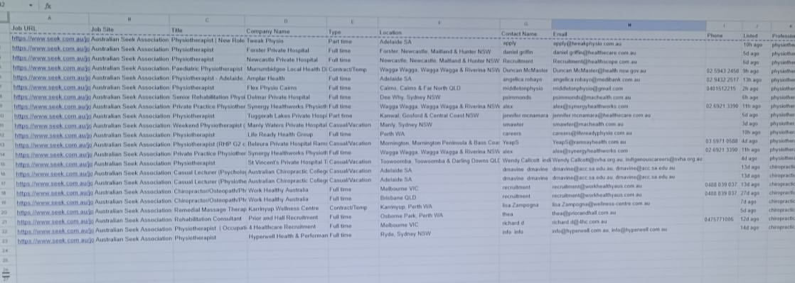

# SCRAPING BOT
This Scrapping Bot collect Jobs from following sites and upload data to Google Sheet. <br>
- https://www.seek.com.au/psychologist-jobs
- https://www.seek.com.au/podiatrist-jobs
- https://www.seek.com.au/physiotherapist-jobs
- https://www.seek.com.au/occupational-therapist-jobs
- https://www.seek.com.au/chiropractic-jobs
- https://www.seek.com.au/speech-pathologist-jobs


### Requirements

* Python 3.9 +
* In `settings.py` replace the `sheet_id` and `sheet_title` with your Google Sheet.

### Setup Google Sheet:
- Google developer console: https://console.developers.google.com
- New project -> activate drive and sheets api
- credentials -> service account -> name + role=editor
  ->create key and download json and save file as `cred_gs.json`
- Share client_email fom json in your sheets
- Create Google Sheet and add below columns in first row <br>
`Job URL | Job Site	| Title	| Company Name | Type	| Location | Contact Name | Email | Phone | Listed	| Profession`

### Installation
1: Create Virtual Environment to Setup.
```bash
python -m venv .venv

For Window:
source .venv/Scripts/activate

For Ubuntu:
source .venv/bin/activate
```

2: Install Dependencies

```bash
pip install -r requirements.txt
```

3: Start Bot
```bash
python bot.py
```

### Output

<br>


